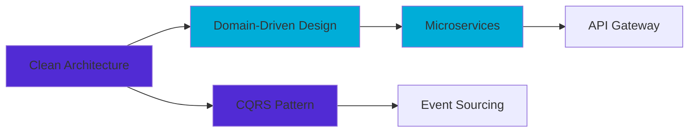

<div align="center">
  
</div>

<div align="center">
  
</div>

<div align="center">
  
[](https://linkedin.com/in/artemios-sologan)
[](mailto:ashologan@gmail.com)
[](tel:+37368842573)
[](https://github.com/Kwameldx666)

</div>

<div align="center">
  
  
  
</div>

<br/>

<p align="center">
  
</p>

---

## 📑 Table of Contents
- [👨‍💻 About Me](#-about-me)
- [🎯 Current Focus](#-current-focus)
- [🛠️ Tech Stack](#️-tech-stack)
- [💼 Professional Experience](#-professional-experience)
- [📊 GitHub Statistics](#-github-statistics)
- [🏅 Skills & Expertise](#-skills--expertise)
- [🎓 Education & Languages](#-education--languages)
- [📫 Let's Connect](#-lets-connect)

---

## 👨‍💻 About Me


```csharp
namespace Developer.Profile
{
    public class ArtemiosSologan : DotNetDeveloper, IPassionate
    {
        // Current Position
        public string CurrentRole => "Intern at MAIB Bank 🏦";
        public string Practice => "Ministry of Finance, Moldova 🏛️";
        public string Status => "🔥 Open to .NET Developer Opportunities";
        
        // Core Specializations
        public IEnumerable<string> Expertise => new[]
        {
            "ASP.NET Core Web API",
            "Blazor (Server & WebAssembly)",
            "Microservices Architecture",
            "Clean Architecture & Domain-Driven Design"
        };
        
        // Professional Journey
        public WorkExperience Experience => new()
        {
            YearsOfExperience = 1,
            Companies = new[] { "Endava", "CODEWER" },
            TechStack = "C#, .NET Core, Blazor, Docker, PostgreSQL",
            Achievements = "Building SPAs, REST APIs, CI/CD Pipelines"
        };
        
        // Development Philosophy
        public string Approach => "Write clean, testable, maintainable code";
        public IEnumerable<string> Principles => new[]
        {
            "SOLID", "DRY", "KISS", "YAGNI"
        };
        
        // What drives me
        public string Passion => 
            "Solving complex problems with elegant solutions 🚀";
    }
}
```

### 🎯 Current Focus

<table>
  <tr>
    <td align="center" width="33%">
      <br>
      <b>MAIB Bank</b><br>
      <sub>Software Development Intern</sub>
    </td>
    <td align="center" width="33%">
      <br>
      <b>Ministry of Finance</b><br>
      <sub>Practical Training</sub>
    </td>
    <td align="center" width="33%">
      <br>
      <b>Open for Opportunities</b><br>
      <sub>.NET Developer Positions</sub>
    </td>
  </tr>
</table>

### 💡 What I'm Working On

- 🔭 Building enterprise-grade applications with **ASP.NET Core**
- 🌱 Deepening knowledge in **Microservices** and **Event-Driven Architecture**
- 👯 Contributing to open-source .NET projects
- 📚 Studying advanced **Clean Architecture** patterns and **DDD**
- ⚡ Exploring **Kubernetes** and **Cloud-Native** development

---

## 🛠️ Tech Stack

<div align="center">

### 💻 Languages & Frameworks

<table>
  <tr>
    <td align="center" width="96">
      
      <br>C#
    </td>
    <td align="center" width="96">
      
      <br>.NET Core
    </td>
    <td align="center" width="96">
      
      <br>Blazor
    </td>
    <td align="center" width="96">
      
      <br>JavaScript
    </td>
    <td align="center" width="96">
      
      <br>Python
    </td>
    <td align="center" width="96">
      
      <br>Java
    </td>
    <td align="center" width="96">
      
      <br>Bash
    </td>
  </tr>
</table>

### 🗄️ Databases & Caching

<table>
  <tr>
    <td align="center" width="96">
      
      <br>PostgreSQL
    </td>
    <td align="center" width="96">
      
      <br>SQL Server
    </td>
    <td align="center" width="96">
      
      <br>Redis
    </td>
  </tr>
</table>

### 🔧 DevOps & Tools

<table>
  <tr>
    <td align="center" width="96">
      
      <br>Docker
    </td>
    <td align="center" width="96">
      
      <br>Git
    </td>
    <td align="center" width="96">
      
      <br>GitHub
    </td>
    <td align="center" width="96">
      
      <br>Actions
    </td>
    <td align="center" width="96">
      
      <br>RabbitMQ
    </td>
    <td align="center" width="96">
      
      <br>Grafana
    </td>
    <td align="center" width="96">
      
      <br>Prometheus
    </td>
  </tr>
</table>

### 🖥️ IDEs & Development Environment

<table>
  <tr>
    <td align="center" width="96">
      
      <br>Visual Studio
    </td>
    <td align="center" width="96">
      
      <br>VS Code
    </td>
    <td align="center" width="96">
      
      <br>Rider
    </td>
    <td align="center" width="96">
      
      <br>Postman
    </td>
  </tr>
</table>

</div>

---

## 💼 Professional Experience

<div align="left">

### 🏢 **Endava** - .NET Developer
<sub>📅 September 2025 - December 2025 | 📍 Chisinau, Moldova</sub>

**Project:** Payment System with Role-Based Access & Banking Transaction Management

<details open>
<summary><b>🎯 Key Responsibilities & Achievements</b></summary>

<br>

| Area | Achievements |
|------|-------------|
| **Backend Development** | • Developed and maintained robust backend services using **C#** and **ASP.NET Core**<br>• Designed scalable RESTful APIs with proper error handling and validation |
| **Database & Performance** | • Optimized SQL queries achieving 40% performance improvement<br>• Implemented **Redis** caching reducing database load by 60% |
| **Security & Auth** | • Built role-based access control (RBAC) with **JWT** authentication<br>• Implemented OAuth 2.0 for secure third-party integrations |
| **DevOps & Quality** | • Containerized applications using **Docker** and Docker Compose<br>• Set up CI/CD pipelines with **GitHub Actions**<br>• Achieved 80%+ code coverage through unit and integration testing |
| **Architecture** | • Applied **SOLID principles** and clean code practices<br>• Implemented asynchronous messaging with **RabbitMQ** for event-driven architecture |

**Technologies:** `C#` `ASP.NET Core` `Entity Framework Core` `PostgreSQL` `Redis` `Docker` `RabbitMQ` `JWT` `xUnit`

</details>

---

### 💻 **CODEWER** - Blazor Developer
<sub>📅 June 2023 - September 2024 | 📍 Chisinau, Moldova</sub>

**Project:** Enterprise CRM Platform (Confidential)

<details>
<summary><b>🎯 Key Responsibilities & Achievements</b></summary>

<br>

| Area | Achievements |
|------|-------------|
| **Frontend Development** | • Developed enterprise SPA using **Blazor WebAssembly** and **Blazor Server**<br>• Built 50+ reusable UI components following component-driven development |
| **Integration** | • Integrated frontend with RESTful APIs using **HttpClient** with proper error handling<br>• Implemented real-time features using **SignalR** |
| **UI/UX** | • Created responsive, accessible interfaces with validation using **FluentValidation**<br>• Implemented complex data tables, modals, and forms with optimal UX |
| **Code Quality** | • Participated in peer code reviews maintaining high code standards<br>• Refactored legacy components improving maintainability by 35% |
| **Collaboration** | • Worked in Agile/Scrum team with daily standups and sprint planning<br>• Utilized Git for version control with feature branch workflow |

**Technologies:** `Blazor WASM` `Blazor Server` `C#` `.NET 6/7` `SignalR` `HTML/CSS` `JavaScript` `Git`

</details>

</div>

---

## 📊 GitHub Statistics

<div align="center">
  
  
</div>

<div align="center">
  
  
</div>

<br/>

<div align="center">
  
</div>

<br/>

<div align="center">
  
</div>

<p align="center">
  
</p>

---

## 🎓 Education & Languages

<div align="center">

<table>
  <tr>
    <td align="center" width="50%">
      
### 🎓 Education


**Technical University of Moldova**  
📍 Chisinau, Moldova  
🎓 Bachelor of Science in Information Technology  
📅 Expected Graduation: **2026**

**Relevant Coursework:**
- Data Structures & Algorithms
- Object-Oriented Programming
- Database Management Systems
- Software Engineering
- Web Technologies
- Computer Networks

</td>
<td align="center" width="50%">

### 🌍 Languages

<br/>

<table>
  <tr>
    <td align="left">
       <b>Russian</b>
    </td>
    <td align="left">
      
    </td>
  </tr>
  <tr>
    <td align="left">
       <b>English</b>
    </td>
    <td align="left">
      
    </td>
  </tr>
  <tr>
    <td align="left">
       <b>Romanian</b>
    </td>
    <td align="left">
      
    </td>
  </tr>
</table>

</td>
  </tr>
</table>

</div>

---

## 🏅 Skills & Expertise

<div align="center">

### 🏗️ Architecture & Design Patterns



<table>
  <tr>
    <td align="center" width="50%">
      
**🎨 Architectural Patterns**


</td>
<td align="center" width="50%">

**🔒 Security & Authentication**


</td>
  </tr>
  <tr>
    <td align="center">
      
**🧪 Testing & Quality**


</td>
<td align="center">

**🚀 DevOps & CI/CD**


</td>
  </tr>
</table>

### 💎 Core Principles & Best Practices

```diff
@@@ Software Engineering Principles @@@
+ SOLID Principles (Single Responsibility, Open/Closed, Liskov, Interface Segregation, Dependency Inversion)
+ DRY (Don't Repeat Yourself)
+ KISS (Keep It Simple, Stupid)
+ YAGNI (You Aren't Gonna Need It)
+ GRASP Patterns

@@@ Design Patterns (Gang of Four) @@@
+ Creational: Factory, Abstract Factory, Singleton, Builder
+ Structural: Adapter, Decorator, Facade, Repository
+ Behavioral: Strategy, Observer, Mediator, Command

@@@ API Development @@@
+ RESTful API Design & Best Practices
+ OpenAPI/Swagger Documentation
+ API Versioning & Deprecation Strategies
+ Rate Limiting & Throttling

@@@ Performance & Scalability @@@
+ Distributed Caching (Redis)
+ Asynchronous Programming (async/await, Task Parallel Library)
+ Message Queuing (RabbitMQ)
+ Database Query Optimization

@@@ Monitoring & Observability @@@
+ Structured Logging (Serilog)
+ Application Metrics (Prometheus)
+ Visualization & Dashboards (Grafana)
+ Health Checks & Diagnostics
```

</div>

---

## 🏆 Professional Highlights

<div align="center">

<table>
  <tr>
    <td align="center">
      <br>
      <b>1+ Year</b><br>
      <sub>.NET Development</sub>
    </td>
    <td align="center">
      <br>
      <b>2 Companies</b><br>
      <sub>Enterprise Experience</sub>
    </td>
    <td align="center">
      <br>
      <b>REST APIs</b><br>
      <sub>Design & Implementation</sub>
    </td>
    <td align="center">
      <br>
      <b>Containerization</b><br>
      <sub>Docker & CI/CD</sub>
    </td>
    <td align="center">
      <br>
      <b>Quality Focused</b><br>
      <sub>80%+ Test Coverage</sub>
    </td>
  </tr>
</table>

<br/>


</div>

---

## 📫 Let's Connect!

<div align="center">

### 💼 Open to Opportunities

 <br>

I'm currently **actively seeking** full-time opportunities as a **.NET Developer**!

<br>

```ascii
╔════════════════════════════════════════════════════════════════╗
║  Looking for a developer who can:                              ║
║  ✓ Build scalable backend systems with ASP.NET Core           ║
║  ✓ Design clean, maintainable architecture                    ║
║  ✓ Implement modern frontend with Blazor                      ║
║  ✓ Work with microservices and distributed systems            ║
║  ✓ Write clean, tested, documented code                       ║
║                                                                 ║
║  Let's talk! 🚀                                                ║
╚════════════════════════════════════════════════════════════════╝
```

<br>

### 📬 Get In Touch

<table>
  <tr>
    <td align="center" width="25%">
      <a href="mailto:ashologan@gmail.com">
        <br>
        <b>Email</b><br>
        <sub>ashologan@gmail.com</sub>
      </a>
    </td>
    <td align="center" width="25%">
      <a href="https://linkedin.com/in/artemios-sologan">
        <br>
        <b>LinkedIn</b><br>
        <sub>artemios-sologan</sub>
      </a>
    </td>
    <td align="center" width="25%">
      <a href="https://github.com/Kwameldx666">
        <br>
        <b>GitHub</b><br>
        <sub>Kwameldx666</sub>
      </a>
    </td>
    <td align="center" width="25%">
      <a href="tel:+37368842573">
        <br>
        <b>Phone</b><br>
        <sub>+373 688 42 573</sub>
      </a>
    </td>
  </tr>
</table>

<br>

[](https://linkedin.com/in/artemios-sologan)
[](mailto:ashologan@gmail.com)
[](https://github.com/Kwameldx666)
[](#)

</div>

---

<div align="center">
  
### 💭 Development Philosophy

<br>

<table>
  <tr>
    <td align="center" width="33%">
      💡<br>
      <b>Write Code for Humans</b><br>
      <sub>Code is read more than written</sub>
    </td>
    <td align="center" width="33%">
      🧪<br>
      <b>Test-Driven Development</b><br>
      <sub>Quality through automated testing</sub>
    </td>
    <td align="center" width="33%">
      📚<br>
      <b>Continuous Learning</b><br>
      <sub>Technology never stops evolving</sub>
    </td>
  </tr>
</table>

<br>

> *"Clean code always looks like it was written by someone who cares."*  
> **— Robert C. Martin**

<br>

> *"The best error message is the one that never shows up."*  
> **— Thomas Fuchs**

<br>

> *"First, solve the problem. Then, write the code."*  
> **— John Johnson**

</div>

---

<div align="center">
  
</div>

<div align="center">
  <sub>⭐️ From <a href="https://github.com/Kwameldx666">Kwameldx666</a> | Built with ❤️ and C#</sub>
</div>
